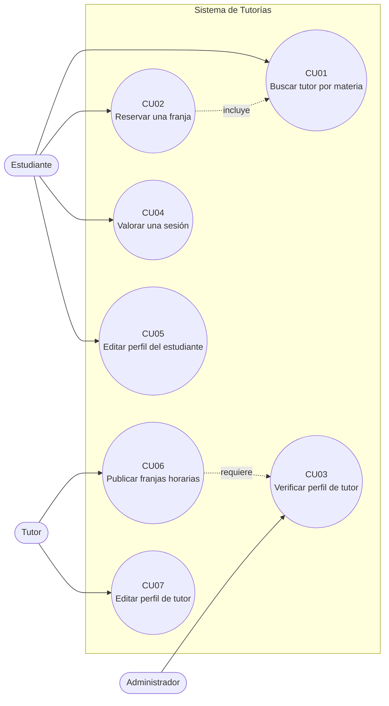
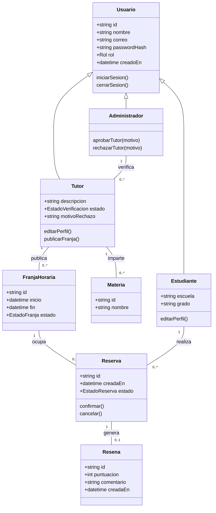
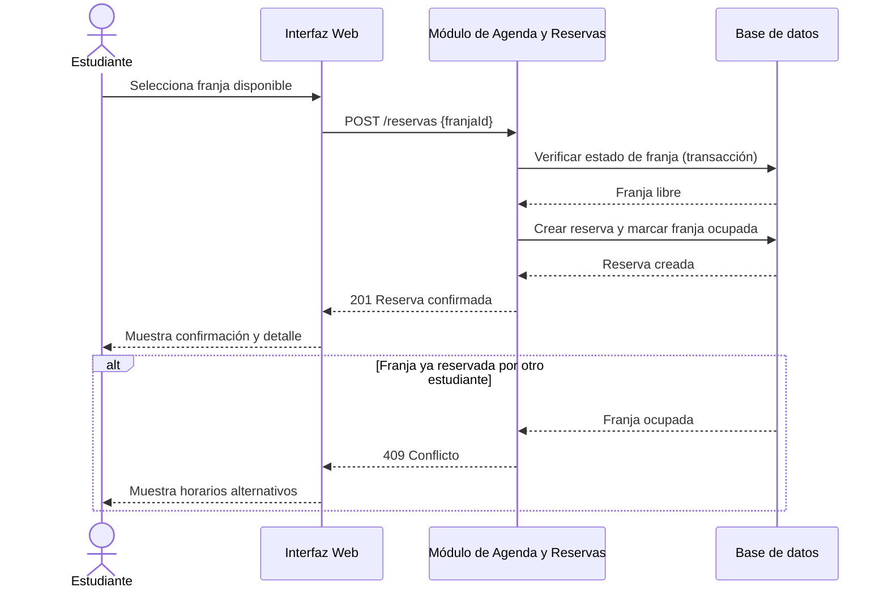
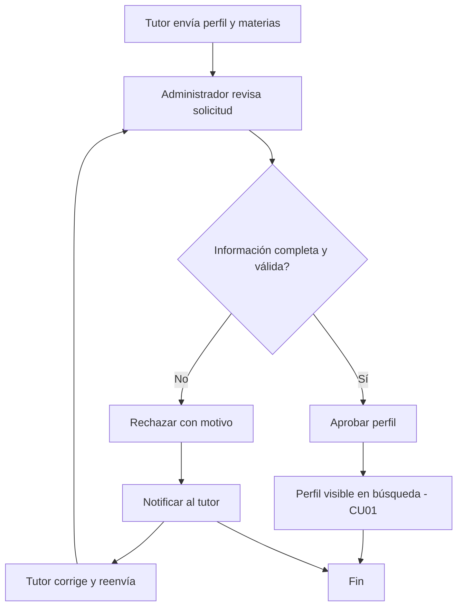
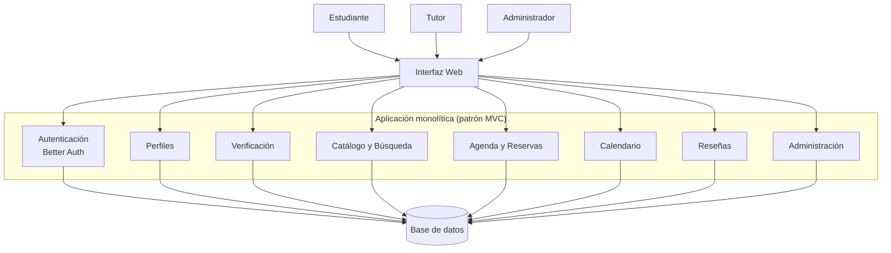

## 1. Modelado UML

### Diagrama de Casos de Uso

La frontera funcional del MVP relaciona al estudiante con búsqueda, reserva, calendario y reseña; al tutor con publicación de perfil, materias y horarios; y al administrador con la verificación de perfiles. CU04 y CU05 se mantienen como capacidades de menor prioridad (ver trazabilidad en Parte 1).

### Especificación de Casos de Uso Principales

Detalle de actor, precondiciones, postcondiciones y flujos de los tres casos de uso desarrollados a profundidad.

#### CU01 — Buscar tutor por materia

| Elemento | Descripción |
| --- | --- |
| Actor principal | Estudiante |
| Precondiciones | El estudiante ha iniciado sesión; existen tutores con estado "aprobado". |
| Postcondiciones (éxito) | El estudiante visualiza una lista de tutores aprobados que coinciden con la materia buscada, junto con sus horarios libres. |
| Postcondiciones (falla) | No se muestran tutores pendientes ni rechazados; si no hay coincidencias, se informa que no hay resultados. |

| Paso | Flujo principal | Flujo alterno |
| --- | --- | --- |
| 1 | El estudiante ingresa a la sección de búsqueda. | **A1.** La materia no existe en el catálogo → el sistema sugiere materias similares. |
| 2 | Selecciona una materia del catálogo. | **A2.** No hay tutores aprobados para la materia → se muestra mensaje de "sin resultados" y sugerencia de notificación futura. |
| 3 | El sistema filtra tutores con estado "aprobado" que imparten esa materia. | |
| 4 | El sistema muestra la lista ordenada (RF10) con ficha resumida de cada tutor. | |
| 5 | El estudiante selecciona un tutor para ver su ficha completa y horarios disponibles. | |

#### CU02 — Reservar una franja

| Elemento | Descripción |
| --- | --- |
| Actor principal | Estudiante |
| Precondiciones | El estudiante tiene sesión activa; el tutor está aprobado; existe al menos una franja futura sin reserva activa. |
| Postcondiciones (éxito) | Se crea una reserva vinculada a la franja y al estudiante; la franja deja de aparecer como disponible para otros estudiantes. |
| Postcondiciones (falla) | No se crea ninguna reserva; la franja conserva su estado original. |

| Paso | Flujo principal | Flujo alterno |
| --- | --- | --- |
| 1 | El estudiante consulta las franjas disponibles de un tutor (CU01). | **A1.** La franja fue tomada por otro estudiante entre la consulta y la confirmación → el sistema responde conflicto (409) y ofrece franjas alternativas. |
| 2 | Selecciona una franja libre. | **A2.** La sesión del estudiante expiró → se solicita iniciar sesión nuevamente antes de confirmar. |
| 3 | Confirma la solicitud de reserva. | |
| 4 | El sistema valida en una transacción que la franja siga libre. | |
| 5 | El sistema crea la reserva y actualiza el estado de la franja. | |
| 6 | El sistema notifica la confirmación al estudiante. | |

#### CU03 — Verificar perfil de tutor

| Elemento | Descripción |
| --- | --- |
| Actor principal | Administrador |
| Precondiciones | Un tutor registró su perfil y materias; el perfil está en estado "pendiente". |
| Postcondiciones (éxito) | El perfil queda en estado "aprobado" y se vuelve visible en la búsqueda (CU01). |
| Postcondiciones (falla) | El perfil queda en estado "rechazado" con un motivo registrado; no aparece en búsquedas. |

| Paso | Flujo principal | Flujo alterno |
| --- | --- | --- |
| 1 | El administrador consulta la lista de perfiles pendientes. | **A1.** La información del tutor está incompleta → el administrador rechaza indicando el motivo y el sistema notifica al tutor para que la corrija. |
| 2 | Selecciona un perfil y revisa datos y materias declaradas. | **A2.** El tutor reenvía el perfil corregido → el caso de uso vuelve al paso 1. |
| 3 | El administrador decide aprobar o rechazar. | |
| 4 | El sistema registra el actor, la decisión y la fecha (RF03). | |
| 5 | El sistema actualiza el estado del perfil. | |

### Diagrama de Clases / Entidad-Relación

Estructura de datos y dominio del problema: jerarquía de usuarios y las relaciones entre materias, franjas, reservas y reseñas.

### Diagrama de Secuencia y Actividades

Flujo de interacción de CU02 (Reservar una franja), módulo crítico por el riesgo de reservas duplicadas identificado en la matriz de riesgos:

Diagrama de actividades de CU03 (Verificar perfil de tutor):

## 2. Diseño de Arquitectura

### Elección del Patrón Arquitectónico

Se elige una **arquitectura monolítica organizada en capas (patrón MVC)**, ya que el sistema tiene un alcance moderado y sus módulos (identidad, perfiles, verificación, catálogo, agenda y reseñas) comparten con frecuencia las mismas entidades de datos (usuario, tutor, franja, reserva). Un monolito simplifica el desarrollo, el despliegue y el mantenimiento al concentrar toda la lógica en una sola aplicación, evitando la complejidad de coordinación entre servicios que exigiría una arquitectura de microservicios para un MVP de este tamaño. La escalabilidad se atiende mediante índices en las columnas más consultadas (materia, estado, inicio) y manteniendo el diseño desacoplado en módulos internos, de forma que una futura migración a microservicios sea viable si el proyecto crece más allá del piloto.

### Diagrama Sintético del Sistema

Los módulos se corresponden con la Matriz de Trazabilidad de la Parte 1: Identidad (RF01), Perfiles (RF02, RF09), Verificación (RF03), Catálogo (RF04, RF10), Agenda y Reservas (RF05, RF06), Calendario (RF07) y Reseñas (RF08), todos sobre una única base de datos compartida.
